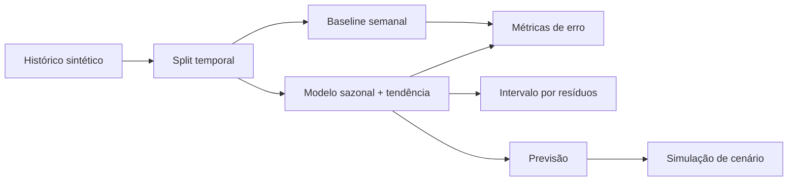

# Cash Flow Intelligence

Previsão de fluxo de caixa e simulações de liquidez com avaliação temporal explícita. Este projeto é uma etapa independente do portfólio financeiro e foi construído para mostrar método, não uma alegação de “IA em produção”.

## Problema

Equipes de tesouraria precisam antecipar pressão de caixa, mas uma curva visual sem validação não é evidência de qualidade. O produto separa quatro coisas que frequentemente são confundidas:

| Conceito | O que entrega | O que não afirma |
| --- | --- | --- |
| Histórico | série diária de saldo, entradas e saídas | que os dados são reais |
| Baseline | média dos quatro últimos mesmos dias da semana | inteligência preditiva avançada |
| Previsão | estimativa sazonal + tendência curta | certeza sobre o caixa futuro |
| Cenário | efeito de premissas informadas | probabilidade calibrada de ocorrência |

## Evidências e limites

- A demonstração usa **180 dias de dados sintéticos determinísticos**. A UI e a API identificam essa origem.
- O treino contém 152 dias; os 28 dias finais ficam isolados como teste temporal.
- O modelo é comparado ao baseline com MAE, RMSE e WAPE.
- A faixa de incerteza usa percentis dos resíduos do período de teste e sua cobertura também é medida.
- Os resultados são reprodutíveis, mas não são uma métrica de produção nem substituem revisão financeira.

## Arquitetura



## Papel da IA

Nesta versão, o motor é deliberadamente explicável e determinístico; não há LLM tomando decisão financeira. Uma camada de IA pode futuramente classificar justificativas, explicar mudanças e sugerir variáveis, sempre com revisão humana e sem substituir os cálculos auditáveis.

## Executar

```bash
docker compose up --build
```

- Interface: `http://localhost:3000`
- API: `http://localhost:8000/docs`

Para desenvolvimento local:

```bash
cd backend && pip install -e '.[dev]' && pytest
cd ../frontend && npm install && npm run build
```

## Endpoints

- `GET /cash-flow/forecast?horizon_days=30` — histórico, validação e previsão.
- `POST /cash-flow/scenarios` — simula variação de recebíveis, saídas e uma saída pontual.

Exemplo de cenário:

```json
{"name":"Recebimentos atrasados","receivables_change_pct":-20,"outflows_change_pct":10,"one_off_outflow":150000,"horizon_days":30}
```

## Próxima evolução responsável

Importação de dados reais com contrato de schema, governança, teste de qualidade e avaliação por janela temporal antes de qualquer alegação de acurácia.
